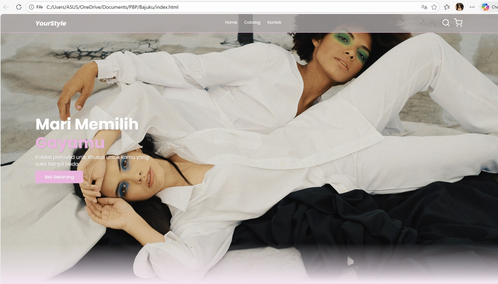

# 👗 YourStyle 

YourStyle is a web-based landing page designed to showcase fashion products with a modern, responsive, and user-friendly interface. This website is built to support digital promotion while delivering an engaging and visually appealing user experience.

## 🚀 Features
- 🛍️ Product catalog with clean layout  
- 🎨 Modern and responsive UI design  
- 🧭 Smooth navigation and user-friendly interface  
- 📍 Google Maps integration  
- 📩 Contact form for user communication

## 🛠️ Technologies Used

### Frontend
- HTML  
- CSS  
- JavaScript  

### Libraries & Tools
- Google Fonts  
- Feather Icons  

## 📂 Project Structure
yourstyle/
├── css/
│ └── style.css
├── js/
│ └── script.js
├── img/
│ ├── header.jpg
│ └── catalog/
│ └── 1.jpg
├── index.html
└── README.md

## 🧪 How to Run the Project

1. Clone the repository: git clone https://github.com/username/yourstyle.git
2. Navigate to the project folder: cd yourstyle
3. Open index.html in your browser.

## 📸 Screenshots

## 🧠 Project Purpose
This project was created to practice front-end web development skills, focusing on layout design, responsiveness, and user experience. It also serves as a digital portfolio project to showcase modern UI design techniques.

## 👩‍💻 Author
Created with ❤️ by  GitHub: [github.com/Khoerunissa99](https://github.com/Khoerunissa99)

This project was created as part of a personal portfolio to showcase front-end development skills.

## 📄 License
This project is licensed under the MIT License.
